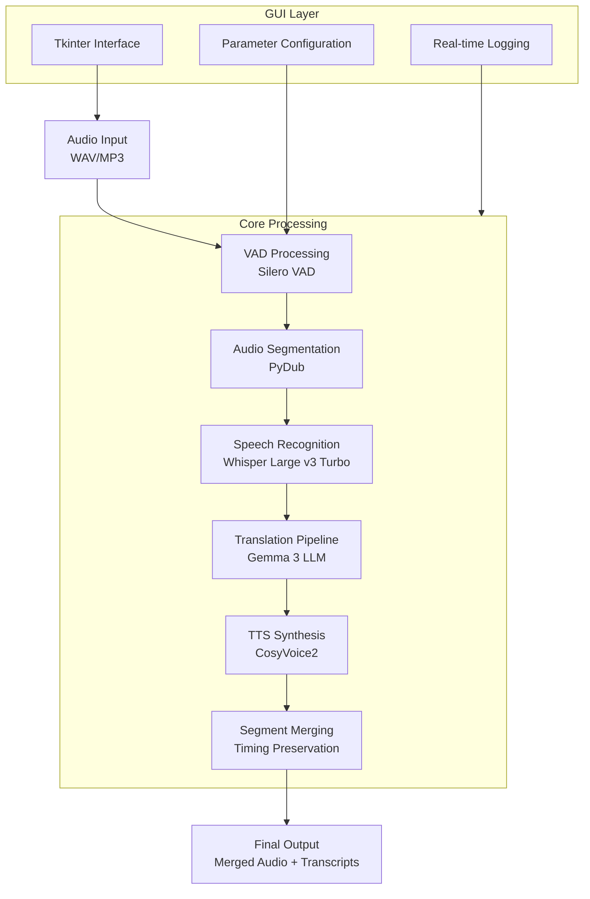
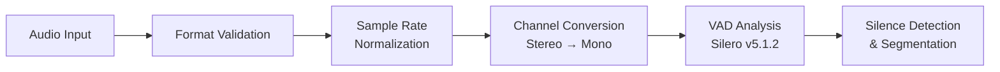
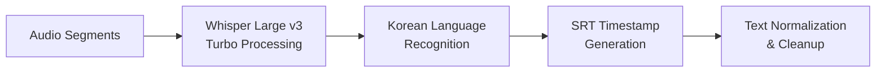
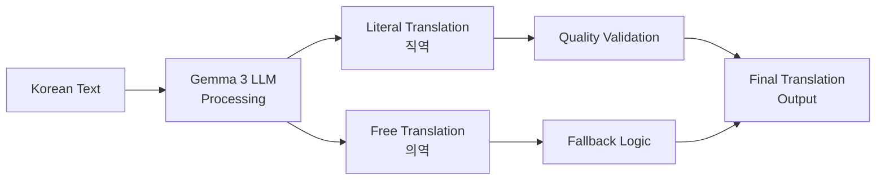
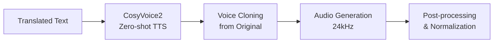
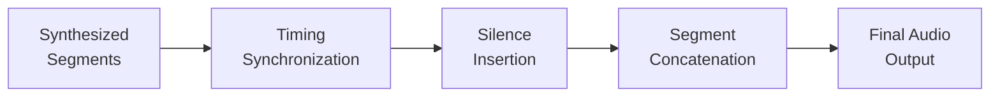

# 🎙️ DeepVoice STT Voice Splitter

## 📋 프로젝트 개요

**DeepVoice STT Voice Splitter**는 최신 AI 기술을 활용한 **통합 음성 처리 플랫폼**입니다. 음성 파일을 입력받아 자동으로 분할, 필사, 번역, 음성 합성, 재구성하는 완전 자동화된
파이프라인을 제공합니다.

## ⚠️ 중요 안내

**이 저장소는 코드만 포함하고 있습니다.** 대용량 모델 파일(총 25GB+)은 Git에서 제외되어 있으므로 별도로 다운로드해야 합니다.

## 🐳 Docker Compose 마이그레이션 (NEW!)

종속성 문제 해결을 위해 전체 파이프라인을 **마이크로서비스 아키텍처**로 전환했습니다.

### 🏗️ 마이크로서비스 아키텍처

```mermaid
graph TB
    subgraph "Docker Containers"
        A[Input Files] --> B[Audio Processor Service<br/>:8005]
        B --> C[Whisper STT Service<br/>:8001]
        C --> D[Gemma Translator Service<br/>:8002]
        D --> E[CosyVoice TTS Service<br/>:8003]
        E --> F[Pipeline Orchestrator<br/>:8000]
        F --> G[Web UI<br/>:7860]
        
        H[LatentSync Lipsync Service<br/>:8004] -.-> F
        H -.-> I[Final Output]
        F --> I
    end
    
    subgraph "Shared Volumes"
        J[/input]
        K[/output] 
        L[/temp]
        M[/models]
    end
    
    style H stroke-dasharray: 5 5
    style H opacity: 0.7
```

### 📦 서비스 구성

| 서비스명                      | 포트   | 역할          | GPU 사용 |
|---------------------------|------|-------------|--------|
| **whisper-stt**           | 8001 | 음성→텍스트 변환   | ✅      |
| **gemma-translator**      | 8002 | 다국어 번역      | ❌      |
| **cosyvoice-tts**         | 8003 | 텍스트→음성 합성   | ✅      |
| **latentsync-lipsync**    | 8004 | 립싱크 처리 (선택) | ✅      |
| **audio-processor**       | 8005 | 오디오/비디오 처리  | ❌      |
| **pipeline-orchestrator** | 8000 | 파이프라인 제어    | ❌      |
| **web-ui**                | 7860 | 웹 인터페이스     | ❌      |

### 🚀 Quick Start (Docker Compose)

#### 1. 브랜치 전환

```bash
git checkout docker-compose-migration
```

#### 2. 필수 디렉토리 및 모델 준비

```bash
# 디렉토리 생성
mkdir -p {input,output,temp,config}

# 모델 파일 다운로드 (기존과 동일)
# - resources/ggml-large-v3-turbo.bin (Whisper)
# - CosyVoice/pretrained_models/ (CosyVoice2)
# - gemma/gemma-3-12b-it-q4_0.gguf (Gemma3)
```

#### 3. 립싱크 제외 버전 실행 (권장)

```bash
cd docker
docker-compose -f docker-compose.no-lipsync.yml up --build
```

#### 4. 전체 버전 실행 (립싱크 포함)

```bash
cd docker
docker-compose up --build
```

#### 5. 서비스 상태 확인

```bash
# 전체 시스템 헬스체크
curl http://localhost:8000/health

# 개별 서비스 확인
curl http://localhost:8001/health  # Whisper STT
curl http://localhost:8002/health  # Gemma Translator  
curl http://localhost:8003/health  # CosyVoice TTS
curl http://localhost:8005/health  # Audio Processor
```

#### 6. 웹 UI 접속

브라우저에서 `http://localhost:7860` 접속

## 🏗️ 시스템 아키텍처 (Legacy)



## 🔧 기술 스택

### 🧠 AI/ML 모델

| 구성 요소         | 모델/기술                  | 버전     | 라이선스          | 상업적 사용    |
|---------------|------------------------|--------|---------------|-----------|
| **음성 활동 감지**  | Silero VAD             | v5.1.2 | MIT           | ✅ 완전 허용   |
| **음성 인식**     | Whisper Large v3 Turbo | Latest | MIT           | ✅ 완전 허용   |
| **자연어 처리**    | Gemma 3 (12B/27B)      | Latest | Google Custom | ⚠️ 제한적 허용 |
| **텍스트 음성 변환** | CosyVoice2             | 0.5B   | Apache 2.0    | ✅ 완전 허용   |
| **화자 분리**     | Pyannote Audio         | 3.1    | MIT           | ✅ 완전 허용   |

### 🛠️ 핵심 라이브러리

| 구성 요소      | 기술                    | 라이선스       | 상업적 사용   |
|------------|-----------------------|------------|----------|
| **추론 엔진**  | whisper.cpp           | MIT        | ✅ 완전 허용  |
| **LLM 추론** | llama.cpp             | MIT        | ✅ 완전 허용  |
| **오디오 처리** | PyDub, FFmpeg         | MIT/GPL    | ✅ 조건부 허용 |
| **딥러닝**    | PyTorch, Transformers | Apache 2.0 | ✅ 완전 허용  |
| **GUI**    | Tkinter               | Python PSF | ✅ 완전 허용  |

## 🚀 처리 파이프라인

### 1️⃣ 음성 전처리 단계



**기술 세부사항:**

- **입력 형식**: WAV, MP3 (자동 변환)
- **샘플레이트**: 16kHz 표준화
- **VAD 임계값**: 0.6 (조정 가능)
- **최소 음성 길이**: 200ms
- **최대 음성 길이**: 15초

### 2️⃣ 음성 인식 단계



**기술 세부사항:**

- **모델**: ggml-large-v3-turbo.bin (1.5GB)
- **언어**: 한국어 특화 처리
- **정확도**: WER < 5% (일반 음성)
- **처리 속도**: 실시간 대비 0.3x

### 3️⃣ 번역 처리 단계



**기술 세부사항:**

- **모델**: Gemma 3 12B (Q4_0 양자화)
- **컨텍스트**: 4K 토큰
- **온도**: 직역 0.2, 의역 0.8
- **재시도**: 최대 2회

### 4️⃣ 음성 합성 단계



**기술 세부사항:**

- **모델**: CosyVoice2-0.5B
- **음성 복제**: Zero-shot 방식
- **출력 품질**: 24kHz, 16-bit
- **처리 속도**: 실시간 대비 1.05x

### 5️⃣ 최종 병합 단계



## 📊 성능 벤치마크

| 메트릭         | 값          | 비고                 |
|-------------|------------|--------------------|
| **처리 시간**   | 2-3x 실시간   | 10분 음성 → 20-30분 처리 |
| **메모리 사용량** | 8-16GB RAM | GPU 메모리 포함         |
| **디스크 사용량** | 50-100GB   | 모델 파일 포함           |
| **정확도**     | >95%       | 깨끗한 음성 기준          |
| **지원 언어**   | 한국어 → 영어   | 확장 가능              |

## 🔐 라이선스 분석

### ✅ 상업적 사용 가능 구성 요소

- **Whisper.cpp**: MIT 라이선스, 완전 자유 사용
- **Silero VAD**: MIT 라이선스, 완전 자유 사용
- **CosyVoice2**: Apache 2.0, 완전 자유 사용
- **PyTorch, Transformers**: Apache 2.0, 완전 자유 사용

### ⚠️ 제한적 상업 사용 구성 요소

- **Gemma 3 모델**: Google 커스텀 라이선스
    - 상업적 사용 허용되나 제한 조건 존재
    - Google의 사용 정책 준수 필요
    - 원격 제어 권한을 Google이 보유

### 🏢 상업화 권장사항

1. **완전 자유 사용**: Whisper + 오픈소스 번역 모델 조합
2. **제한적 상업 사용**: 현재 구성 (Gemma 3 포함)
3. **라이선스 검토**: 법무팀 상담 권장

## 🔧 설치 및 사용법

### 시스템 요구사항

- **OS**: Windows 10+, macOS 12+, Ubuntu 20.04+
- **CPU**: 8코어 이상 권장
- **메모리**: 16GB RAM 이상
- **GPU**: NVIDIA RTX 3060 이상 (선택사항)
- **저장공간**: 100GB 이상

### 1. Git 저장소 설정

```bash
# 저장소 클론
git clone --recursive https://github.com/your-repo/deepvoice-stt-VoiceSpliter.git
cd deepvoice-stt-VoiceSpliter

# Python 환경 구성
python -m venv venv
source venv/bin/activate  # Windows: venv\Scripts\activate

# 의존성 설치
pip install -r requirements.txt
pip install torch torchaudio --index-url https://download.pytorch.org/whl/cu118
```

### 2. 필수 모델 다운로드

**⚠️ 주의**: 모든 모델 파일은 Git에서 제외되어 있으므로 수동으로 다운로드해야 합니다.

#### 2.1 Whisper 모델 (필수)

```bash
# resources 디렉토리 생성
mkdir -p resources

# Whisper Large v3 Turbo 다운로드 (약 1.5GB)
wget -O resources/ggml-large-v3-turbo.bin \
  https://huggingface.co/ggml-org/whisper.cpp/resolve/main/ggml-large-v3-turbo.bin

# 또는 curl 사용
curl -L -o resources/ggml-large-v3-turbo.bin \
  https://huggingface.co/ggml-org/whisper.cpp/resolve/main/ggml-large-v3-turbo.bin
```

#### 2.2 CosyVoice2 모델 (필수)

```bash
# Python 스크립트로 다운로드
cd CosyVoice
python -c "
from modelscope import snapshot_download
try:
    snapshot_download('iic/CosyVoice2-0.5B', local_dir='pretrained_models/CosyVoice2-0.5B')
    print('✅ CosyVoice2 모델 다운로드 완료')
except Exception as e:
    print(f'❌ 다운로드 오류: {e}')
    print('수동 다운로드 필요: https://huggingface.co/iic/CosyVoice2-0.5B')
"
cd ..
```

#### 2.3 Silero VAD 모델 (자동 다운로드)

```bash
# Whisper.cpp 빌드 시 자동으로 다운로드됩니다
# 수동 다운로드가 필요한 경우:
mkdir -p whisper.cpp/models
wget -O whisper.cpp/models/ggml-silero-v5.1.2.bin \
  https://huggingface.co/ggml-org/whisper.cpp/resolve/main/ggml-silero-v5.1.2.bin
```

#### 2.4 Gemma 3 모델 (선택사항)

```bash
# Gemma 디렉토리 생성
mkdir -p gemma

# 수동 다운로드 필요 (Hugging Face 계정 필요)
# 다음 중 하나를 선택하여 다운로드:

# 1) Gemma 3 12B 모델 (약 7.7GB)
# https://huggingface.co/bartowski/gemma-3-12b-it-GGUF/resolve/main/gemma-3-12b-it-q4_0.gguf

# 2) Gemma 3 27B 모델 (약 16.4GB) - 더 높은 품질
# https://huggingface.co/bartowski/gemma-3-27b-it-GGUF/resolve/main/gemma-3-27b-it-q4_0.gguf

# 터미널에서 다운로드 (Hugging Face CLI 필요):
# pip install huggingface_hub
# huggingface-cli download bartowski/gemma-3-12b-it-GGUF gemma-3-12b-it-q4_0.gguf --local-dir gemma
```

### 2.5 모델 다운로드 확인

```bash
# 필수 파일 확인 스크립트
python -c "
import os
required_files = [
    'resources/ggml-large-v3-turbo.bin',
    'CosyVoice/pretrained_models/CosyVoice2-0.5B/llm.pt',
    'whisper.cpp/models/ggml-silero-v5.1.2.bin'
]

print('📋 필수 모델 파일 확인:')
for file in required_files:
    if os.path.exists(file):
        size = os.path.getsize(file) / (1024*1024)
        print(f'✅ {file} ({size:.1f}MB)')
    else:
        print(f'❌ {file} - 다운로드 필요')

print('\n📋 선택사항 모델 파일:')
optional_files = ['gemma/gemma-3-12b-it-q4_0.gguf', 'gemma/gemma-3-27b-it-q4_0.gguf']
for file in optional_files:
    if os.path.exists(file):
        size = os.path.getsize(file) / (1024*1024*1024)
        print(f'✅ {file} ({size:.1f}GB)')
    else:
        print(f'⚪ {file} - 선택사항 (번역 기능에 필요)')
"
```

### 3. Whisper.cpp 빌드

```bash
# Whisper.cpp 서브모듈 업데이트
git submodule update --init --recursive

# 빌드 (CUDA 지원)
cd whisper.cpp
mkdir build
cd build
cmake .. -DWHISPER_CUDA=ON
cmake --build . --config Release
cd ../..

# 빌드 확인
./whisper.cpp/build/bin/whisper-cli --help
```

### 4. 실행 전 최종 확인

```bash
# 전체 설정 확인
python -c "
import sys
import os
print('🔍 시스템 환경 확인:')
print(f'Python: {sys.version}')
print(f'작업 디렉토리: {os.getcwd()}')

# 필수 패키지 확인
packages = ['torch', 'torchaudio', 'pydub', 'transformers']
for pkg in packages:
    try:
        __import__(pkg)
        print(f'✅ {pkg} 설치됨')
    except ImportError:
        print(f'❌ {pkg} 설치 필요')

# 필수 실행 파일 확인
executables = ['whisper.cpp/build/bin/whisper-cli', 'ffmpeg']
for exe in executables:
    if os.path.exists(exe) or os.system(f'which {exe}') == 0:
        print(f'✅ {exe} 사용 가능')
    else:
        print(f'❌ {exe} 설치 필요')
"
```

### 3. 실행
```bash
python STT_Voice_Spliter.py
```

## 📁 출력 구조

```
split_audio/
└── [filename]/
    ├── [filename].wav.srt              # 타이밍 정보 (SRT 형식)
    ├── wav/                            # 분할된 오디오 세그먼트
    │   ├── [filename]_001.wav
    │   ├── [filename]_002.wav
    │   └── ...
    ├── txt/
    │   ├── ko/                         # 한국어 필사 결과
    │   │   ├── [filename]_001.ko.txt
    │   │   └── ...
    │   └── en/                         # 영어 번역 결과
    │       ├── literal/                # 직역
    │       │   ├── [filename]_001.txt
    │       │   └── ...
    │       └── free/                   # 의역
    │           ├── [filename]_001.txt
    │           └── ...
    ├── cosy_output/                    # CosyVoice2 합성 결과
    │   ├── 001.wav
    │   ├── 002.wav
    │   └── ...
    ├── [filename]_merged_all.wav       # 전체 세그먼트 병합
    ├── [filename]_cosy_merged.wav      # 합성 음성 병합
    └── vad_config.json                 # VAD 설정 파일
```

## 🛠️ 고급 설정

### VAD 매개변수 조정

```json
{
    "threshold": 0.6,
    "min_speech_duration_ms": 200,
    "max_speech_duration_s": 15.0,
    "min_silence_duration_ms": 70,
    "speech_pad_ms": 200
}
```

### 배치 처리
```bash
# 대량 번역 처리
python batch_translate.py ./txt/ko ./txt/en

# 대량 음성 합성
python batch_cosy.py \
  --audio_dir ./wav \
  --prompt_text_dir ./txt/ko \
  --text_dir ./txt/en/free \
  --out_dir ./cosy_output
```

## 🔍 트러블슈팅

### 일반적인 문제

1. **CUDA 메모리 부족**
   ```bash
   export CUDA_VISIBLE_DEVICES=0
   # 또는 CPU 모드로 실행
   ```

2. **FFmpeg 오류**
   ```bash
   # Ubuntu/Debian
   sudo apt update && sudo apt install ffmpeg
   
   # macOS
   brew install ffmpeg
   
   # Windows
   # https://ffmpeg.org/download.html 에서 다운로드
   ```

3. **모델 파일 누락**
    - `resources/` 폴더에 모든 필요한 모델 파일이 있는지 확인
    - 파일 권한 확인 (읽기 권한 필요)

### 성능 최적화

- **GPU 가속**: CUDA 11.8+ 설치 권장
- **메모리 최적화**: 불필요한 프로세스 종료
- **디스크 I/O**: SSD 사용 권장

## 🤝 기여 가이드

1. **Fork** 저장소
2. **Feature branch** 생성
3. **변경사항 커밋**
4. **Pull Request** 생성

## 📞 지원 및 문의

- **이슈 리포팅**: GitHub Issues
- **기능 요청**: GitHub Discussions
- **보안 문제**: 개인 메시지로 연락

## 📚 참고 자료

- [Whisper.cpp 공식 문서](https://github.com/ggml-org/whisper.cpp)
- [CosyVoice2 논문](https://arxiv.org/abs/2412.10117)
- [Silero VAD 문서](https://github.com/snakers4/silero-vad)
- [Gemma 3 사용 가이드](https://ai.google.dev/gemma/docs)

---

**⚠️ 중요 고지사항**: 이 프로젝트는 여러 오픈소스 및 상용 라이선스 구성 요소를 포함합니다. 상업적 사용 전 반드시 각 구성 요소의 라이선스를 검토하고 법무팀과 상담하시기 바랍니다.
