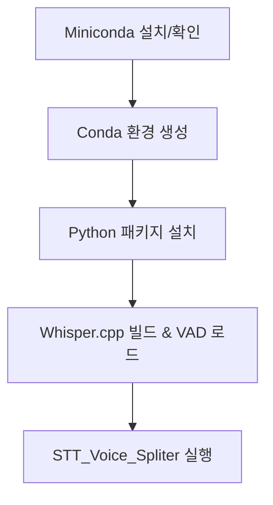

# Whisper 설치 및 오디오 필사 도구

이 프로젝트는 Whisper 기반 음성 필사 도구의 설치와 실행을 위한 GUI 애플리케이션입니다.

## 주요 기능

- **Miniconda 설치 및 확인:**  
  시스템에 Miniconda가 없으면 자동 설치 후 활성화합니다.
  
- **Conda 환경 생성:**  
  필요한 패키지를 포함한 `stt_env` 환경을 생성합니다.

- **Python 패키지 설치:**  
  필요한 라이브러리(`requests`, `aiohttp`, `torch` 등)를 자동으로 설치합니다.

- **Whisper.cpp 빌드 및 VAD 모델 로드:**  
  Whisper.cpp 저장소를 클론 또는 미리 번들된 파일을 사용해 빌드합니다.  
  Silero VAD 모델을 미리 로드해 음성 구간 감지를 수행합니다.

- **오디오 파일 필사 실행:**  
  선택된 오디오 파일을 변환, 분할하고 Whisper CLI를 통해 필사 결과를 생성합니다.

## 동작 개요

아래 다이어그램은 전체 설치 및 실행 과정의 핵심 흐름을 간략하게 보여줍니다.

